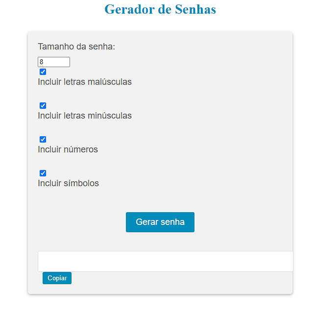

# Gerador de Senhas

## Descrição
O Gerador de Senhas é uma aplicação web que gera senhas seguras de forma aleatória. Este projeto foi desenvolvido como parte do meu aprendizado em desenvolvimento web.

## Funcionalidades Principais
- Geração de senhas seguras com opções personalizáveis de comprimento e tipos de caracteres.
- Copiar a senha gerada para a área de transferência.
- Interface simples e intuitiva.

## Tecnologias Utilizadas
- HTML5
- CSS3 (com pré-processador SASS/SCSS)
- JavaScript
- Bootstrap (opcional, dependendo da preferência e necessidade de um framework CSS)
- Git (para controle de versão)

## Como Utilizar
1. Clone o repositório (`git clone https://github.com/AngeloHervis/Gerador-de-Senhas.git`).
2. Abra o arquivo `index.html` em seu navegador web.
3. Escolha o comprimento da senha desejada e marque as opções de caracteres especiais, números, letras maiúsculas e letras minúsculas.
4. Clique no botão "Gerar Senha" para gerar uma nova senha.
5. Clique no botão "Copiar" para copiar a senha gerada para a área de transferência.

## Autor
Angelo Hervis
- GitHub: [AngeloHervis](https://github.com/AngeloHervis)
- LinkedIn: [Angelo Hervis](https://www.linkedin.com/in/angelo-hervis/)